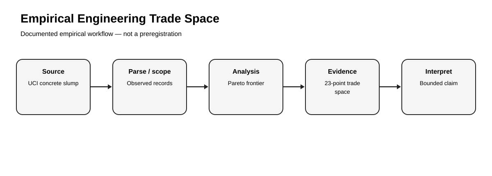
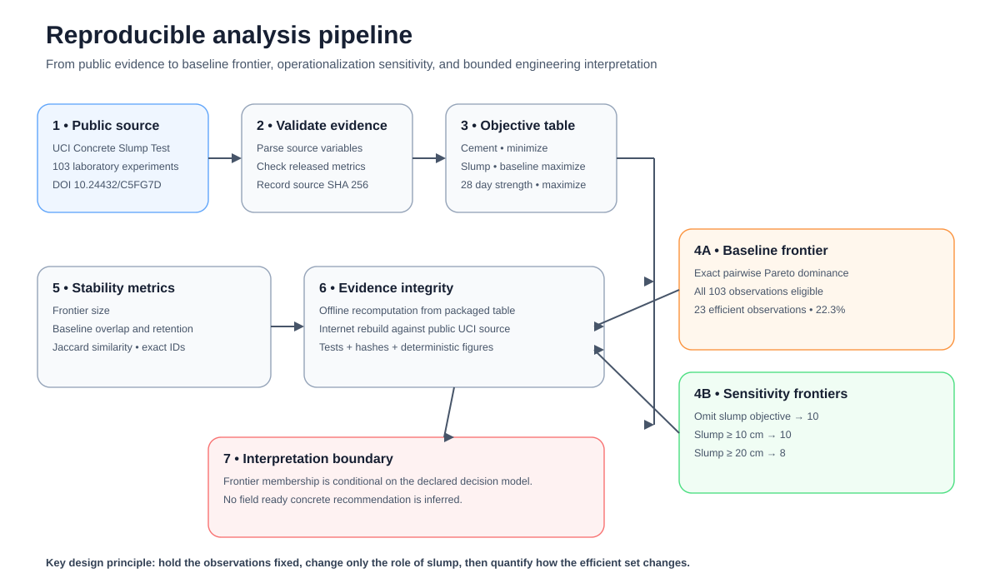
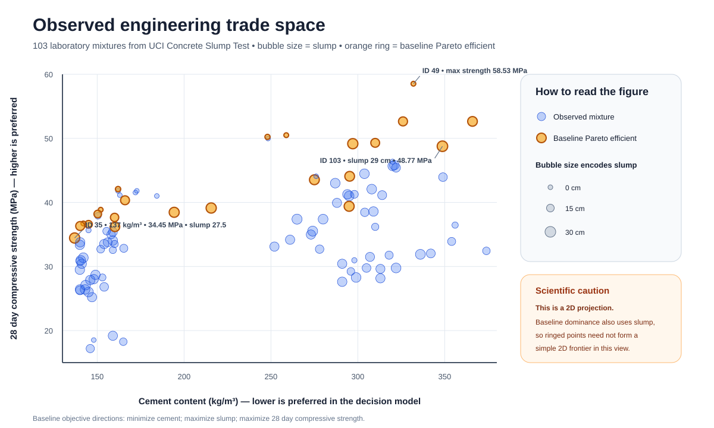
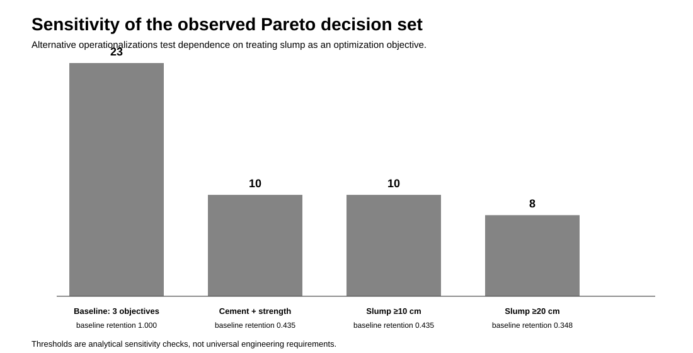
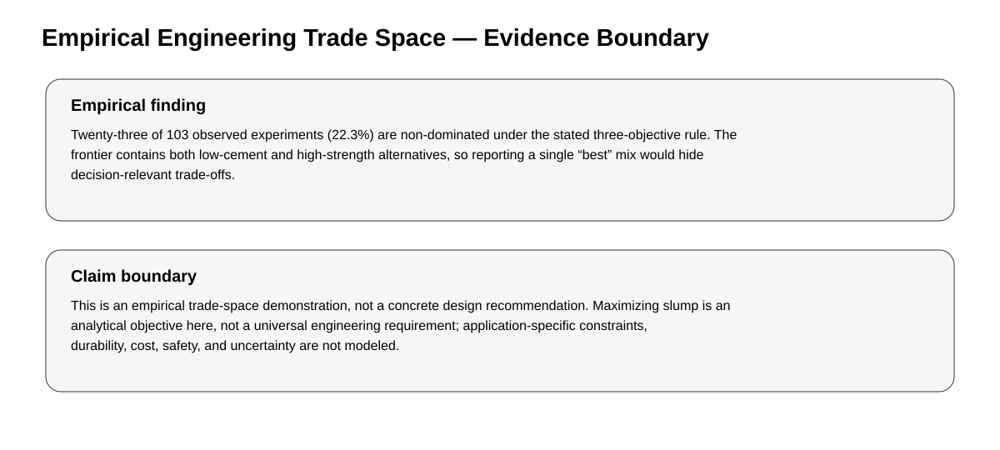

# Empirical Engineering Design Trade Space: Concrete Slump Experiments

[](https://github.com/devissaputra/empirical_engineering_tradespace/actions/workflows/ci.yml)
[](https://github.com/devissaputra/empirical_engineering_tradespace/actions/workflows/empirical-rebuild.yml)

> **Empirical Research Bundle** · **Portfolio Track: Engineering Management Research** · Systems Engineering / Trade-Space Analysis / Decision Analysis

A reproducible secondary study of 103 UCI concrete-slump experiments. The repository uses observed laboratory alternatives to examine Pareto-efficient design choices and then tests how the decision set changes when slump is operationalized differently.



## Study status

**Completed secondary empirical analysis with sensitivity analysis.** Reported findings were calculated from the named public source on 25 September 2026. The public-source rebuild has no synthetic fallback. `data/source_manifest.json` records provenance, licensing, retrieval information, and the evidence-integrity policy.

## Research questions

1. Which observed alternatives are non-dominated when cement is minimized while slump and 28-day compressive strength are maximized?
2. How stable is that observed decision set when slump is removed as an optimization objective or treated as an eligibility threshold instead?

## Design

- **Design:** Secondary multi-objective analysis of 103 laboratory mixture experiments
- **Source:** UCI Concrete Slump Test
- **Dataset DOI:** 10.24432/C5FG7D
- **Source page:** https://archive.ics.uci.edu/dataset/182/concrete%2Bslump%2Btest
- **Direct data endpoint:** `https://archive.ics.uci.edu/ml/machine-learning-databases/concrete/slump/slump_test.data`
- **Retrieval / analysis date:** 2026-09-25
- **License reported by UCI:** CC BY 4.0

## Primary analysis

The baseline specification minimizes cement and maximizes both slump and 28-day compressive strength. An observation is Pareto-efficient when no other observed mixture is at least as good on all three objectives and strictly better on at least one.



### Primary finding

Twenty-three of 103 observed experiments (22.3%) are non-dominated under the baseline three-objective rule. The frontier spans materially different cement, workability, and strength profiles, so a single weighted ranking would suppress decision-relevant trade-offs.

### Headline metrics

- **Experiments:** 103
- **Mean cement:** 229.89 kg/m³
- **Mean 28-day strength:** 36.04 MPa
- **Mean slump:** 18.05 cm
- **Baseline Pareto count:** 23
- **Baseline Pareto fraction:** 0.223
- **Maximum observed strength:** 58.53 MPa
- **Minimum observed cement:** 137.0 kg/m³



## Sensitivity analysis

The baseline treats higher slump as preferable. Because that is not a universal engineering objective, the repository now executes three alternative specifications rather than merely noting this limitation.

| Specification | Eligible observations | Pareto count | Baseline retention | Jaccard vs baseline |
|---|---:|---:|---:|---:|
| Baseline: minimize cement, maximize slump and strength | 103 | 23 | 1.000 | 1.000 |
| Minimize cement, maximize strength; slump omitted | 103 | 10 | 0.435 | 0.435 |
| Same two objectives, restricted to slump ≥ 10 cm | 84 | 10 | 0.435 | 0.435 |
| Same two objectives, restricted to slump ≥ 20 cm | 63 | 8 | 0.348 | 0.348 |

The sensitivity result is substantive: the observed frontier changes considerably when the role of slump changes. That means the decision set is **operationalization-dependent**, which is exactly why objective definitions must be explicit in engineering trade-space work. The 10 cm and 20 cm cutoffs are analytical thresholds used to probe robustness; they are **not** presented as universal concrete-design requirements.



## What this study can and cannot claim

**Can claim:** the repository reproducibly identifies non-dominated observations in the named UCI dataset under four declared operationalizations and quantifies how much the resulting decision sets overlap.

**Cannot claim:** the results prescribe a concrete mix for field use. Durability, cost, safety, uncertainty, project-specific workability targets, curing conditions, and other engineering constraints are not modeled. The sensitivity thresholds are analytical probes rather than design standards.



## Reproduce

Offline verification of the packaged empirical results:

```bash
python -m pip install -r requirements.txt
pytest -q
python run_demo.py
python scripts/run_sensitivity.py --check
```

Recompute the primary empirical analysis from the public source:

```bash
python scripts/fetch_and_analyze.py --check
```

Regenerate all five SVG figures:

```bash
python scripts/generate_figures.py
```

The public-source rebuild computes a SHA-256 digest of the retrieved source bytes and reports it in the run output. Research-relevant source drift is additionally guarded by exact checks on the released headline metrics and baseline frontier IDs. The packaged objective table is independently hashed in `data/source_manifest.json`.

## Research bundle contents

- `README.md` — study overview, primary findings, sensitivity results, and claim boundaries
- `EMPIRICAL_STUDY.md` — protocol, operationalization, robustness analysis, validity, and interpretation
- `data/source_manifest.json` — source provenance, license note, evidence-integrity policy, and packaged-data checksum
- `data/derived/objective_observations.csv` — all 103 observations used for offline frontier recomputation
- `data/derived/primary_results.csv` — complete 23-point baseline Pareto frontier
- `data/derived/sensitivity_results.csv` — complete robustness summary across four specifications
- `results/empirical_summary.json` — machine-readable primary results
- `results/sensitivity_summary.json` — machine-readable sensitivity results
- `scripts/fetch_and_analyze.py` — public-source rebuild and source-consistency check
- `scripts/run_sensitivity.py` — deterministic robustness recomputation and packaged-output check
- `scripts/generate_figures.py` — dependency-free generation of five study-specific SVG figures
- `research/model.py` — reusable dominance, frontier, validation, and sensitivity functions
- `tests/` — behavioral, empirical-invariant, and sensitivity-regression tests
- `docs/` — analysis plan, research design, data dictionary, paper blueprint, references, and originality map
- `assets/` — five study-specific SVG figures

## Research integrity

This bundle distinguishes **source data**, **operationalization**, **result**, **sensitivity**, and **interpretation**. The analysis plan documents the released analysis and is **not a preregistration**. The study is a secondary analysis of public data, not primary data collection, peer review, or external validation.
